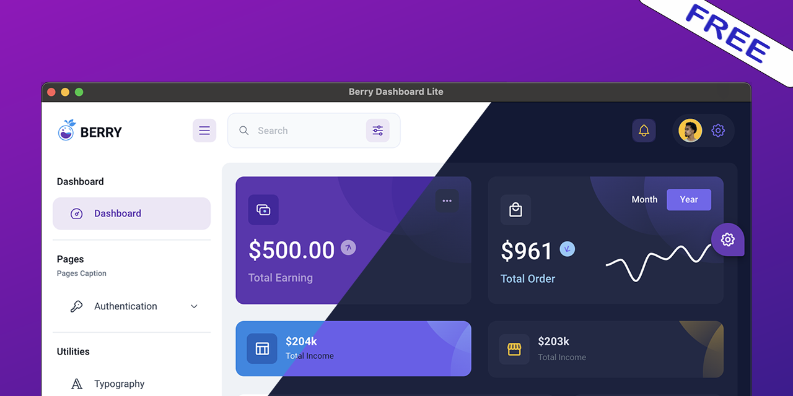

<br />
<br />

# electron-berry-free
An open-source Electron-based dashboard app, written in javascript and react.js.

uses <a href="https://electron.atom.io/">Electron</a>, <a href="https://facebook.github.io/react/">React</a>, <a href="https://github.com/reactjs/react-router">React Router</a>, <a href="https://webpack.js.org/">Webpack</a> and <a href="https://www.npmjs.com/package/react-refresh">React Fast Refresh</a>.
<br />
<br />

## Based on

| #      | Github Porject      | Description |
| ----------- | ----------- | ----------- |
| 1      | [Berry Free React Material UI Admin Template](https://github.com/codedthemes/berry-free-react-admin-template)| a free Material UI admin dashboard template built with React. It is meant to provide the best possible User Experience with highly customizable feature-rich pages. It is a complete Dashboard Template that has easy and intuitive responsive design whether it is viewed on retina screens or laptops.       |
| 2   | [Electron React Boilerplate](https://github.com/electron-react-boilerplate/electron-react-boilerplate)   | uses <a href="https://electron.atom.io/">Electron</a>, <a href="https://facebook.github.io/react/">React</a>, <a href="https://github.com/reactjs/react-router">React Router</a>, <a href="https://webpack.js.org/">Webpack</a> and <a href="https://www.npmjs.com/package/react-refresh">React Fast Refresh</a>.        |


<br>

## Main dependencies

```
  "dependencies": {
    "@mui/material": "^5.15.10",
    "apexcharts": "^3.52.0",
    "prop-types": "^15.8.1",
    "react": "^18.2.0",
    "react-redux": "^9.1.0",
    "react-router-dom": "^6.16.0",
    "redux": "^5.0.1",
  },
  "devDependencies": {
    "electron": "^26.2.1",
    "electron-builder": "^24.13.3",
    "sass": "^1.67.0",
    "typescript": "^5.2.2",
    "webpack": "^5.88.2",
  }
```

<br>


## Install

```
node -v
v18.14.1
```
Clone the repo and install dependencies:

```
$ git clone https://github.com/12343954/electron-berry-free.git your-project-name
```
```
$ cd your-project-name
```
```
$ `yarn` or `npm install`
```

## Starting Development

Start the app in the `dev` environment:

```bash
`yarn start` or `npm start`
```

## Packaging for Production

To package apps for the local platform:

```bash
`yarn package` or `npm run package` 
```

### Enjoy it 😄

## MIT License


